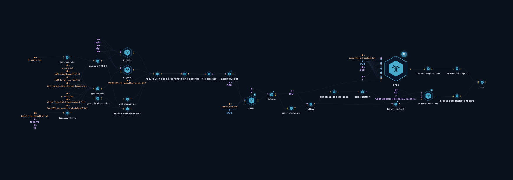

<h1 align="center">ZIP Domains <a href="https://twitter.com/intent/tweet?text=Newly%20registered%20.zip%20domains%0Ahttps%3A%2F%2Fgithub.com%2Ftrickest%2Fzip"></a></h1>
<h3 align="center">Newly registered .zip domains</h3>

Welcome to our project dedicated to providing up-to-date data on newly registered .zip domains. With the recent introduction of the [.zip top-level domain (TLD)](https://domains.google/tld/zip/) by Google, [concerns have arisen](https://medium.com/@bobbyrsec/the-dangers-of-googles-zip-tld-5e1e675e59a5) within the community regarding potential attack vectors associated with this TLD. To address these concerns and ensure the safety of internet users, we have initiated this workflow aimed at gathering comprehensive information about .zip domains as they are registered.


## Objective

Our mission is to provide a reliable and regularly updated dataset that contains valuable insights into newly registered .zip domains. By systematically collecting and analyzing information, we aim to shed light on potential risks and help the community make informed decisions when interacting with these domains. Our project focuses on promoting online security and mitigating any potential threats associated with the .zip TLD.

### Disclaimer

While we strive to provide accurate and up-to-date information, it is important to note that our project serves as a supplementary resource and should not be considered a definitive indicator of the security status of any .zip domain. It is crucial for users to exercise their own judgment and employ additional security measures when interacting with any domain, including those under the .zip TLD.

# DNS Data

This repository contains DNS data organized into CSV files. Each CSV file represents a collection of DNS records and includes the following properties for each record:

- Host: The hostname or domain associated with the record.
- A: The IP address corresponding to the host.
- SOA: Start of Authority record for the domain.
- NS: Name Servers responsible for the domain.
- Status Code: The DNS response code for the query.
- CDN: Indicates whether the record is served through a Content Delivery Network (CDN).
- CDN Name: The name of the CDN used, if applicable.

## The data

Here's an example of how the data is structured in the CSV files:


| Filename | Hosts                                          | SOA                            | NS                                                                 | Status Code | A                                                              | CDN | CDN Name | AAAA                          | MX | TXT | CNAME | CAA | PTR | Has Internal IPs | Internal IPs                                    |
|----------|------------------------------------------------|--------------------------------|--------------------------------------------------------------------|-------------|----------------------------------------------------------------|-----|----------|-------------------------------|----|-----|-------|-----|-----|------------------|------------------------------------------------|
| backup.zip  | ns1.name.com, hostmaster.nsone.net              | ns4fmw.name.com, ns2dky.name.com, ns1bdg.name.com, ns3dkz.name.com | NOERROR                                                            |             | 91.195.240.94, 163.114.216.17, 163.114.216.49, 163.114.217.17, 163.114.217.49 |     |          | 2a00:edc0:107::49              |    |     |       |     |     |                  |                                                  |
| microsoft-office.zip  | ns1.name.com, hostmaster.nsone.net              | ns4fmw.name.com, ns2dky.name.com, ns1bdg.name.com, ns3dkz.name.com | NOERROR                                                            |             | 91.195.240.94, 163.114.216.17, 163.114.216.49, 163.114.217.17, 163.114.217.49 |     |          | 2a00:edc0:107::49              |    |     |       |     |     |                  |                                                  |
## How It Works


### TB; DZ (Too big; didn't zoom):

1. Download [479k English words](https://github.com/dwyl/english-words) to be used as wordlist
2. Download top [10 Million Websites](https://www.domcop.com/top-10-million-websites). Use a bash script to delete .tlds and get only the company names
3. Use bash to create permutations for company names with wordlists (`backup`, `update`, etc)

```
while read -r word; do
    while read -r line; do
        echo "${word}${line}"
        echo "${line}${word}"
        echo "${line}-${word}"
        echo "${word}-${line}"
    done < domains.txt
done < words.txt
```
4. Download [NewDomains_ZIP File](https://raw.githubusercontent.com/CronUp/EnAnalisis/main/2023-05-15_NewDomains_ZIP) and merge it with all generated data
5. Use [raft-small-words](https://raw.githubusercontent.com/danielmiessler/SecLists/master/Discovery/Web-Content/raft-small-words.txt), [raft-large-words](https://raw.githubusercontent.com/danielmiessler/SecLists/master/Discovery/Web-Content/raft-large-words.txt), [raft-large-directories-lowercase](https://raw.githubusercontent.com/danielmiessler/SecLists/master/Discovery/Web-Content/raft-large-directories-lowercase.txt), [directory-list-lowercase-2.3-big](https://raw.githubusercontent.com/danielmiessler/SecLists/master/Discovery/Web-Content/directory-list-lowercase-2.3-big.txt)
6. Use [mgwls](https://github.com/trickest/mgwls) to generate `.zip` tlds
7. Use bash to create permutations

```
while read -r word; do
    while read -r line; do
        echo "${word}${line}"
        echo "${line}${word}"
        echo "${line}-${word}"
        echo "${word}-${line}"
    done < domains.txt
done < words.txt
```

4. Generate batched pattern to be able to execute the workflow in parallel on 50 machines
5. Use [puredns](https://github.com/d3mondev/puredns) for faster resolving
6. Use [dnsx](https://github.com/projectdiscovery/dnsx) to resolve and get JSON data
7. Merge the data from parallel executions
8. Create CSV `zip-domains.csv`  with `python`
9. Push to repository

## Contribution
All contributions/ideas/suggestions are welcome! Feel free to create a new ticket via [GitHub issues](https://github.com/trickest/cloud/issues), tweet at us [@trick3st](https://twitter.com/trick3st), or join the conversation on [Discord](https://discord.gg/7HZmFYTGcQ).

## Build your own workflows
We believe in the value of tinkering; cookie-cutter solutions rarely cut it. Sign up to [Trickest](https://trickest.com) to customize this workflow to your use case, get access to many more workflows, or build your own workflows from scratch!

[](https://trickest-access.paperform.co/)